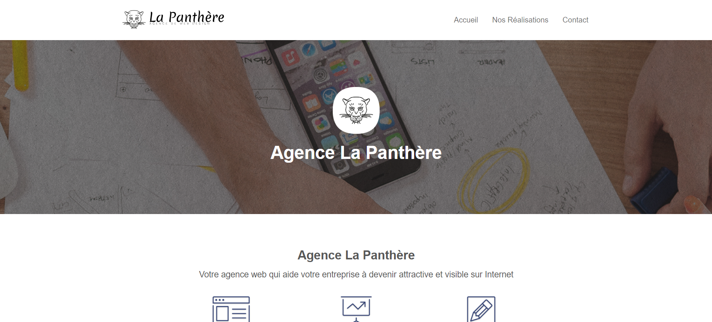

# Agence La Panthère

### Projet 4 | Parcours "Développeur web" OpenClassrooms - Optimisez un site web existant

## Mission

## Documents et Documentation

* [Rapport d'analyse](https://drive.google.com/file/d/1IRrnfayhBkfEN2sK4pcchNFvSfpFx4TD/view?usp=drive_link)
* Rapport d'optimisation : 
* Check-list pour accessibilité mobile : https://developer.mozilla.org/fr/docs/Web/Accessibility/Mobile_accessibility_checklist

## Liens

* Lien vers le repo GitHub : https://github.com/CarolePignat/La-Panthere-initial
* Lien vers le site initial : https://carolepignat.github.io/La-Panthere-initial/
* Lien vers le site optimisé : https://carolepignat.github.io/La-Panthere/